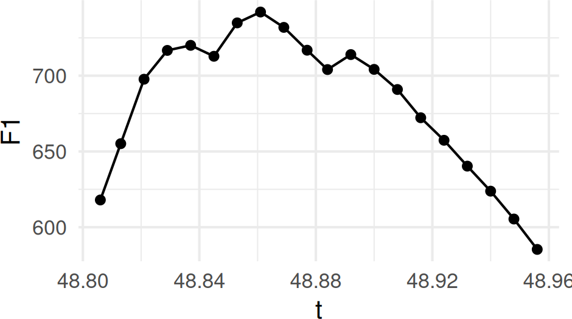
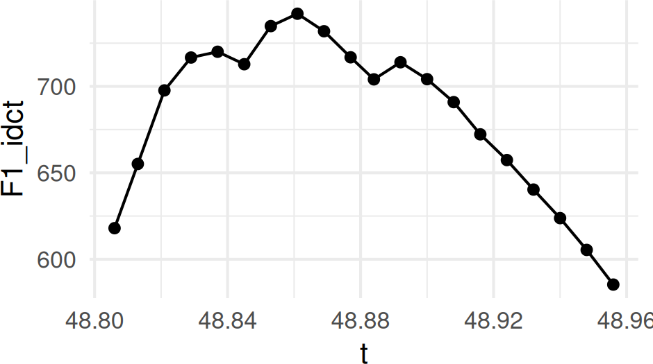
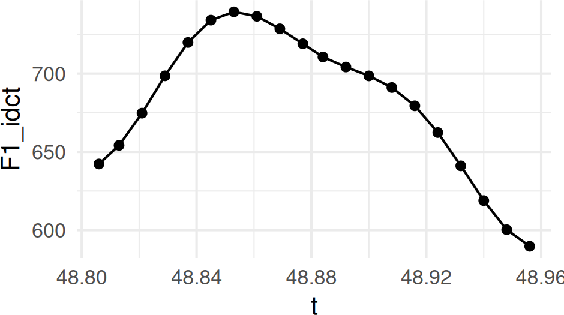
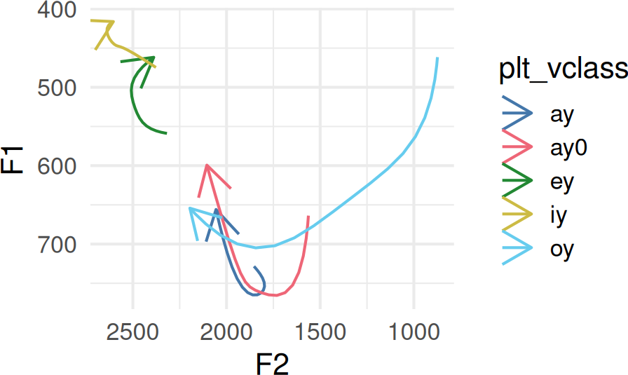
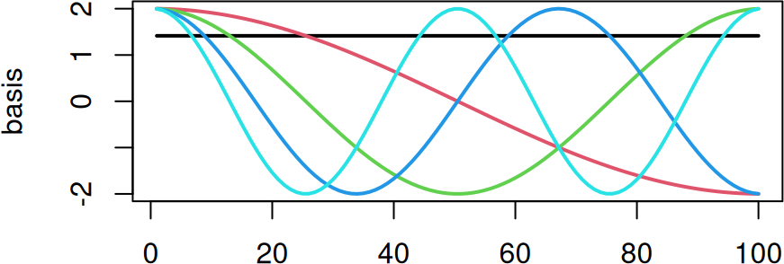

# The Discrete Cosine Transform

``` r

library(tidynorm)
library(dplyr)
library(tibble)
library(ggplot2)
```

plotting defaults

``` r

options(
  ggplot2.discrete.colour = c(
    lapply(
      1:6,
      \(x) c(
        "#4477AA", "#EE6677", "#228833",
        "#CCBB44", "#66CCEE", "#AA3377"
      )[1:x]
    )
  ),
  ggplot2.discrete.fill = c(
    lapply(
      1:6,
      \(x) c(
        "#4477AA", "#EE6677", "#228833",
        "#CCBB44", "#66CCEE", "#AA3377"
      )[1:x]
    )
  )
)

theme_set(
  theme_minimal(
    base_size = 16
  )
)
```

## A brief description

The Discrete Cosine Transform re-describes an input signal as a set of
coefficients. These coefficients can be converted back into the original
signal, or simplified, to get back a smoothed form of the original
signal.

For example here is an F1 track with 20 measurement points from the
`speaker_tracks` data set.

``` r

one_track <- speaker_tracks |>
  filter(
    speaker == "s01",
    id == 9
  )
```

``` r

one_track |>
  ggplot(aes(t, F1)) +
  geom_point() +
  geom_line()
```



Figure 1: F1 Formant Track

If we apply
[`dct()`](https://jofrhwld.github.io/tidynorm/reference/dct.md) to the
F1 track, we’ll get back 20 DCT coefficients.

``` r

dct(one_track$F1)
#>  [1] 482.3728655  16.5472580 -25.0305876  -3.4475760  -8.8201713  -2.4903558
#>  [7]  -3.1619876  -2.9428915  -5.2993291  -0.9811638   0.5681181   0.7707920
#> [13]  -0.4318330   0.2322257  -0.3945702  -0.5995980  -0.4285492   0.8180725
#> [19]   0.7793962  -0.1793681
```

And, if we apply
[`idct()`](https://jofrhwld.github.io/tidynorm/reference/idct.md) to
these coefficients, we’ll get back the original track.

``` r

one_track |>
  mutate(
    F1_dct = dct(F1),
    F1_idct = idct(F1_dct)
  ) |>
  ggplot(
    aes(t, F1_idct)
  ) +
  geom_point() +
  geom_line()
```



Figure 2: idct(dct(F1))

However, if we apply
[`idct()`](https://jofrhwld.github.io/tidynorm/reference/idct.md) to
just the first few DCT coefficients, we’ll get back a smoothed version
of the formant track.

``` r

one_track |>
  mutate(
    F1_dct = dct(F1),
    F1_idct = idct(F1_dct[1:5], n = n())
  ) |>
  ggplot(
    aes(t, F1_idct)
  ) +
  geom_point() +
  geom_line()
```



Figure 3: DCT smoothed F1

## DCT functions in tidynorm

There are three `reframe_with_*` functions in tidynorm.

- [`reframe_with_dct()`](https://jofrhwld.github.io/tidynorm/reference/reframe_with_dct.md)

  - This will take a data frame of formant tracks, and return a data
    frame of DCT coefficients.

  - You need to be able to identify which rows belong to individual
    tokens, and can identify a column for the time domain.

- [`reframe_with_idct()`](https://jofrhwld.github.io/tidynorm/reference/reframe_with_idct.md)

  - This will take a data frame of DCT coefficients, and return a data
    frame of formant tracks.

  - You need to be able to identify which rows belong to individual
    tokens, and can identify a column for the parameter number.

- [`reframe_with_dct_smooth()`](https://jofrhwld.github.io/tidynorm/reference/reframe_with_dct_smooth.md)

  - This combines
    [`reframe_with_dct()`](https://jofrhwld.github.io/tidynorm/reference/reframe_with_dct.md)
    and
    [`reframe_with_idct()`](https://jofrhwld.github.io/tidynorm/reference/reframe_with_idct.md)
    into one step, taking in a data frame of formant tracks, and
    returning a data frame of smoothed formant tracks.

  - You need to be able to identify which rows belong to individual
    tokens, and can identify a column for the time domain.

## Getting average formant tracks

To get average formant tracks for each vowel, you’ll need to

1.  Reframe the original formant tracks as DCT coefficients.
2.  Average over each parameter number for every vowel.
3.  Reframe these averages using the inverse DCT.

``` r

# focusing on one speaker
one_speaker <- speaker_tracks |>
  filter(speaker == "s01")

dct_smooths <- one_speaker |>
  # step 1, reframing as dct coefficients
  reframe_with_dct(
    F1:F3,
    .token_id_col = id,
    .time_col = t
  ) |>
  # step 2, averaging over parameter number and vowel
  summarise(
    across(F1:F3, mean),
    .by = c(.param, plt_vclass)
  ) |>
  # step 3, reframing with inverse DCT
  reframe_with_idct(
    F1:F3,
    # this time, the id column is the vowel class
    .token_id_col = plt_vclass,
    .param_col = .param
  )
```

``` r

dct_smooths |>
  filter(
    plt_vclass %in% c("iy", "ey", "ay", "ay0", "oy")
  ) |>
  ggplot(
    aes(F2, F1)
  ) +
  geom_path(
    aes(
      group = plt_vclass,
      color = plt_vclass
    ),
    arrow = arrow()
  ) +
  scale_y_reverse() +
  scale_x_reverse()
```



Figure 4: DCT smoothed formant trajectories.

## The DCT Basis

The DCT decomposes an input signal as a combination of weighted cosine
functions, and returns those weights. You can access the cosine
functions it uses with
[`dct_basis()`](https://jofrhwld.github.io/tidynorm/reference/dct_basis.md).

``` r

basis <- dct_basis(100, 5)
matplot(basis, type = "l", lty = 1, lwd = 2)
```



One way to think about it is that the DCT is using these cosine
functions in a regression, and the values that get returned are the
coefficients.

``` r

dct(one_track$F1)[1:5]
#> [1] 482.372866  16.547258 -25.030588  -3.447576  -8.820171
```

``` r

lm(
  one_track$F1 ~ dct_basis(20, 5) - 1
) |>
  coef()
#> dct_basis(20, 5)1 dct_basis(20, 5)2 dct_basis(20, 5)3 dct_basis(20, 5)4 
#>        482.372866         16.547258        -25.030588         -3.447576 
#> dct_basis(20, 5)5 
#>         -8.820171
```

For more details on the mathematical formulation of the DCT, see the
[`dct()`](https://jofrhwld.github.io/tidynorm/reference/dct.md) help
page.
