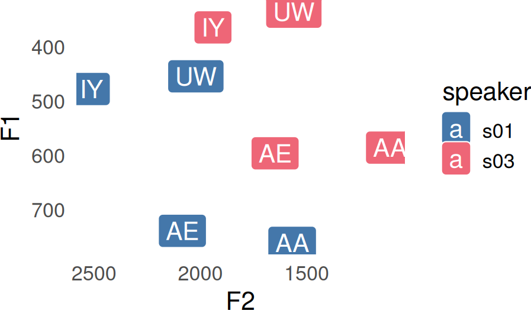
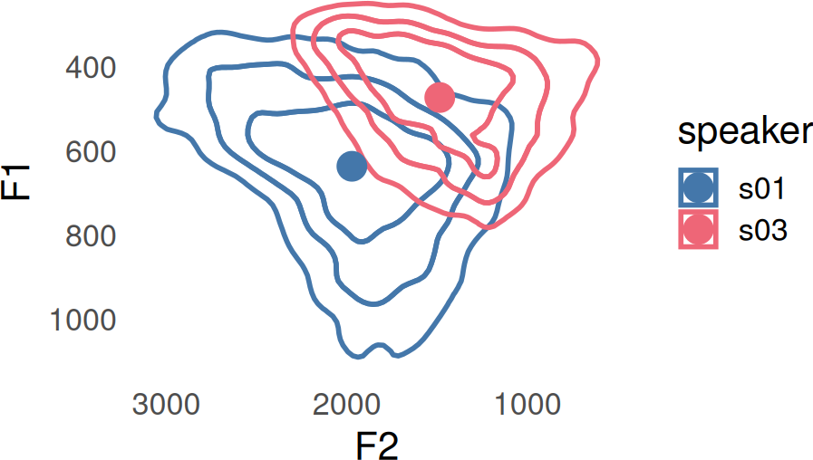
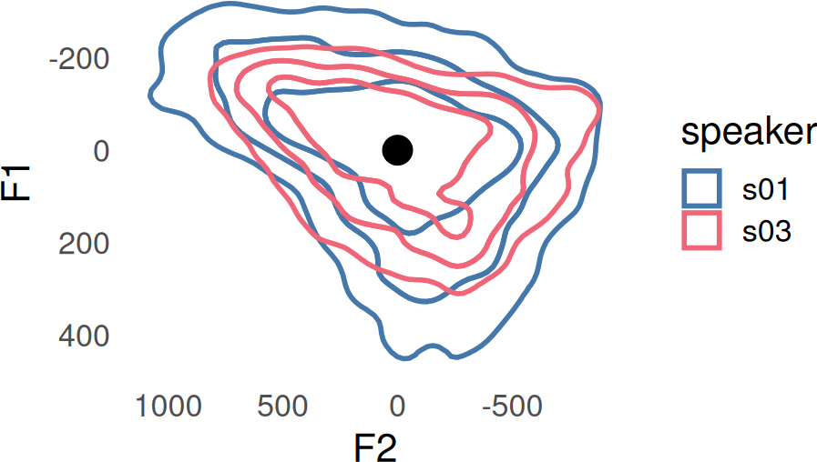
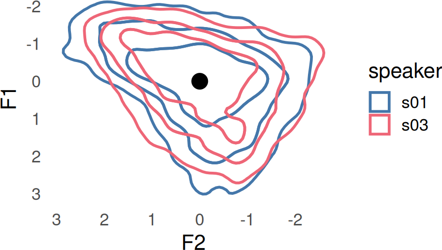
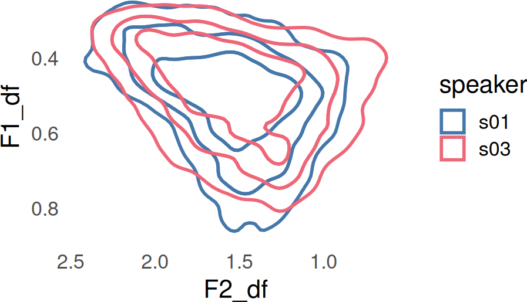

# Normalization Overview

## Introduction to the problem

``` r

library(tidynorm)
library(dplyr)
library(tidyr)
```

``` r

library(ggplot2)
library(ggdensity)
```

color palette

``` r

options(
  ggplot2.discrete.colour = c(
    lapply(
      1:6,
      \(x) c(
        "#4477AA", "#EE6677", "#228833",
        "#CCBB44", "#66CCEE", "#AA3377"
      )[1:x]
    )
  ),
  ggplot2.discrete.fill = c(
    lapply(
      1:6,
      \(x) c(
        "#4477AA", "#EE6677", "#228833",
        "#CCBB44", "#66CCEE", "#AA3377"
      )[1:x]
    )
  )
)

theme_set(
  theme_minimal(base_size = 16) +
    theme(
      panel.grid = element_blank()
    )
)
```

Vowel formant frequencies are heavily influenced by speakers’ vocal
tract length, such that equivalent vowels can have dramatically
different formant frequencies

``` r

speaker_data |>
  summarise(
    .by = c(speaker, vowel),
    across(
      F1:F3,
      \(x)mean(x, na.rm = T)
    )
  ) ->
speaker_means
```

Plotting Code

``` r

speaker_means |>
  filter(
    vowel %in% c("IY", "UW", "AE", "AA")
  ) |>
  ggplot(
    aes(F2, F1)
  ) +
  geom_label(
    aes(
      label = vowel,
      fill = speaker
    ),
    color = "white"
  ) +
  scale_y_reverse() +
  scale_x_reverse()
```



Vowel Comparison

``` r

speaker_means |>
  filter(
    vowel %in% c("IY", "UW", "AE", "AA")
  ) |>
  pivot_longer(
    F1:F3,
    names_to = ".formant_name",
    values_to = ".formant"
  ) |>
  pivot_wider(
    names_from = vowel,
    values_from = .formant
  ) |>
  arrange(
    .formant_name
  )
#> # A tibble: 6 × 6
#>   speaker .formant_name    IY    AA    AE    UW
#>   <chr>   <chr>         <dbl> <dbl> <dbl> <dbl>
#> 1 s01     F1             477.  761.  739.  454.
#> 2 s03     F1             364.  585.  596.  335.
#> 3 s01     F2            2513. 1568. 2084. 2021.
#> 4 s03     F2            1941. 1109. 1648. 1560.
#> 5 s01     F3            3264. 2938. 3095. 3081.
#> 6 s03     F3            2726. 2269. 2518. 2412.
```

When conducting an analysis that combines multiple different speakers’
data together, we often want to factor out this vocal tract length
difference, so that we can instead focus our attention on the *relative*
values of these vowel frequencies within speakers.

### An example

Speakers s01 and s03 in the `speakers_data` data set have very different
vowel spaces that differ both in the location of their center points,
and scaling.

Plotting code

``` r

speaker_centers <- speaker_data |>
  summarise(
    .by = speaker,
    across(
      F1:F3,
      ~ mean(.x, na.rm = T)
    )
  )

speaker_data |>
  ggplot(
    aes(F2, F1, color = speaker)
  ) +
  stat_hdr(
    probs = c(0.95, 0.8, 0.5),
    fill = NA,
    alpha = 1,
    linewidth = 1
  ) +
  geom_point(
    data = speaker_centers,
    size = 5
  ) +
  scale_x_reverse() +
  scale_y_reverse()
```



One approach to moving speakers center points to a common location is to
subtract the mean from both F1 and F2.

``` r

speaker_data_centered <- speaker_data |>
  mutate(
    .by = speaker,
    across(
      F1:F3,
      ~ .x - mean(.x, na.rm = T)
    )
  )
```

Now s01 and s03’s center points have a common location, but the scale of
s03’s vowels is still smaller than s01’s.

Plotting code

``` r

speaker_data_centered |>
  ggplot(
    aes(F2, F1, color = speaker)
  ) +
  stat_hdr(
    probs = c(0.95, 0.8, 0.5),
    fill = NA,
    alpha = 1,
    linewidth = 1
  ) +
  geom_point(
    data = tibble(),
    aes(x = 0, y = 0),
    color = "black",
    size = 5,
  ) +
  scale_y_reverse() +
  scale_x_reverse()
```



An approach to putting speakers’ vowel spaces on a common scale is to
divide by the standard deviation.

``` r

speaker_data_scaled <- speaker_data |>
  mutate(
    .by = speaker,
    across(
      F1:F3,
      ~ .x / sd(.x, na.rm = T)
    )
  )
```

The result is two vowel spaces with center points in the same location,
and on a common scale.

Plotting code

``` r

speaker_data_scaled |>
  mutate(
    .by = speaker,
    across(
      F1:F3,
      ~ (.x - mean(.x, na.rm = T)) / sd(.x, na.rm = T)
    )
  ) |>
  ggplot(
    aes(F2, F1, color = speaker)
  ) +
  stat_hdr(
    probs = c(0.95, 0.8, 0.5),
    fill = NA,
    alpha = 1,
    linewidth = 1
  ) +
  geom_point(
    data = tibble(),
    aes(x = 0, y = 0),
    color = "black",
    size = 5,
  ) +
  scale_y_reverse() +
  scale_x_reverse()
```



## Generalizing Normalization Procedures

All speaker normalization techniques involves some form of Location
shift (L), Scaling (S), or both. If F is an unnormalized formant value,
and \hat{F} is the normalized value, then:

\hat{F} = \frac{F-L}{S}

The primary differences between normalization methods are:

- The use of across-the-board data transformations.

- The calculation function for L and S.

- The scope of calculating L and S.

The example above is also known as Lobanov Normalization (see
[`norm_lobanov()`](https://jofrhwld.github.io/tidynorm/reference/norm_lobanov.md)).
The
[`norm_generic()`](https://jofrhwld.github.io/tidynorm/reference/norm_generic.md)
function allows for flexible definitions of normalization procedures
with this in mind.

### Examples

##### \DeltaF

The \DeltaF method was described in Johnson
([2020](#ref-johnsonDFMethodVocal2020)).

- It uses no across-the-board data transformation.

- It uses a scaling factor S called \DeltaF, which is the mean across
  all formants of the formant frequency in Hz, divided by the formant
  number minus 0.5.

- S is calculated across all formants

S = \Delta F = \text{mean}\left(\frac{F\_{ij}}{i-0.5}\right)

This can be expressed with
[`norm_generic()`](https://jofrhwld.github.io/tidynorm/reference/norm_generic.md)
like so

``` r

speaker_data |>
  norm_generic(
    F1:F3,
    .by = speaker,
    .by_formant = FALSE,
    .by_token = FALSE,
    .L = 0,
    .S = mean(
      .formant / (.formant_num - 0.5),
      na.rm = T
    ),
    .names = "{.formant}_df"
  ) ->
speaker_df_norm
#> Normalization info
#> • normalized with `tidynorm::norm_generic()`
#> • normalized `F1`, `F2`, and `F3`
#> • normalized values in `F1_df`, `F2_df`, and `F3_df`
#> • grouped by `speaker`
#> • within formant: FALSE
#> • (.formant - 0)/(mean(.formant/(.formant_num - 0.5), na.rm = T))
```

``` r

ggplot(
  speaker_df_norm,
  aes(F2_df, F1_df, color = speaker)
) +
  stat_hdr(
    probs = c(0.95, 0.8, 0.5),
    fill = NA,
    alpha = 1,
    linewidth = 1
  ) +
  scale_y_reverse() +
  scale_x_reverse()
```



Johnson, Keith. 2020. “The ΔF Method of Vocal Tract Length Normalization
for Vowels.” *Laboratory Phonology: Journal of the Association for
Laboratory Phonology* 11 (11): 10.
<https://doi.org/10.5334/labphon.196>.
