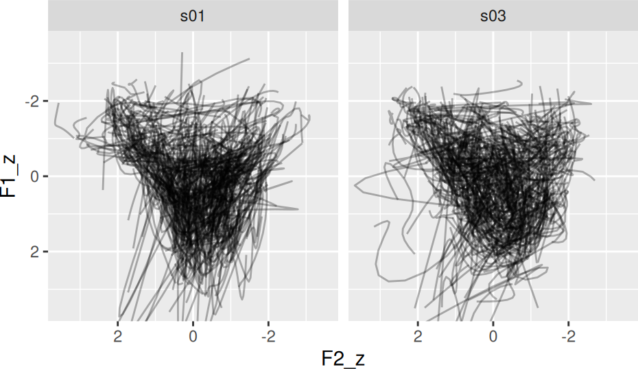

# Normalizing Formant Tracks

``` r

library(tidynorm)
```

``` r

library(ggplot2)
```

Tidynorm normalizes vowel formant tracks by

1.  Converting them to Discrete Cosine Transform coefficients.
2.  Directly normalizing the DCT coefficients.
3.  Applying the inverse DCT.

## Token IDs

In order to do this successfully, each vowel token needs to be uniquely
identifiable with a token id, or a token id in combination with other
columns. For example, in
[`tidynorm::speaker_tracks`](https://jofrhwld.github.io/tidynorm/reference/speaker_tracks.md)
the column `speaker` combined with the column `id` identifies each
unique vowel formant track.

``` r

speaker_tracks
#> # A tibble: 19,500 × 9
#>    speaker    id vowel plt_vclass word      t    F1    F2    F3
#>    <chr>   <dbl> <chr> <chr>      <chr> <dbl> <dbl> <dbl> <dbl>
#>  1 s01         0 EY    eyF        OKAY   32.4  754. 2145. 2913.
#>  2 s01         0 EY    eyF        OKAY   32.4  719. 2155. 2913.
#>  3 s01         0 EY    eyF        OKAY   32.4  752. 2115. 2914.
#>  4 s01         0 EY    eyF        OKAY   32.4  762. 2087. 2931.
#>  5 s01         0 EY    eyF        OKAY   32.4  738. 2088. 2933.
#>  6 s01         0 EY    eyF        OKAY   32.4  697. 2123. 2936.
#>  7 s01         0 EY    eyF        OKAY   32.4  640. 2143. 2928.
#>  8 s01         0 EY    eyF        OKAY   32.5  540. 2153. 2936.
#>  9 s01         0 EY    eyF        OKAY   32.5  441. 2164. 2936.
#> 10 s01         0 EY    eyF        OKAY   32.5  497. 2201. 2945.
#> # ℹ 19,490 more rows
```

For most normalization procedures, we’ll want to group the data by the
speaker column anyway, and in those cases it’s sufficient to pass `id`
to the `.token_id_col` argument of `norm_track_*` functions.

We can Lobanov normalize these speakers’ formant tracks with
[`norm_track_lobanov()`](https://jofrhwld.github.io/tidynorm/reference/norm_track_lobanov.md).

``` r

normed_tracks <- speaker_tracks |>
  norm_track_lobanov(
    # identify the formant columns
    F1:F3,

    # provide speaker grouping
    .by = speaker,

    # provide token id
    .token_id_col = id,

    # provide an optional time column
    .time_col = t
  )
#> Normalization info
#> • normalized with `tidynorm::norm_track_lobanov()`
#> • normalized `F1`, `F2`, and `F3`
#> • normalized values in `F1_z`, `F2_z`, and `F3_z`
#> • token id column: `id`
#> • time column: `t`
#> • grouped by `speaker`
#> • within formant: TRUE
#> • (.formant - mean(.formant, na.rm = T))/sd(.formant, na.rm = T)
```

``` r

normed_tracks |>
  ggplot(
    aes(F2_z, F1_z)
  ) +
  geom_path(
    aes(
      group = interaction(speaker, id)
    ),
    alpha = 0.3
  ) +
  scale_y_reverse() +
  scale_x_reverse() +
  facet_wrap(~speaker) +
  coord_cartesian(
    xlim = c(3.5, -3.5),
    ylim = c(3.5, -3.5)
  ) +
  theme(
    aspect.ratio = 1
  )
```


